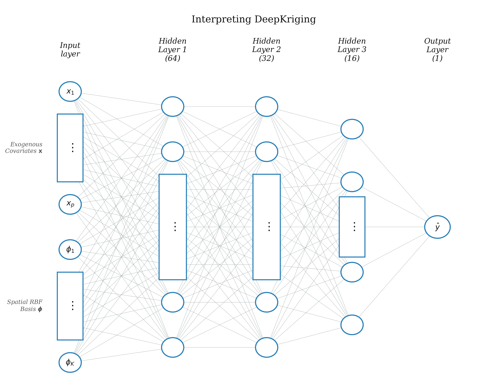
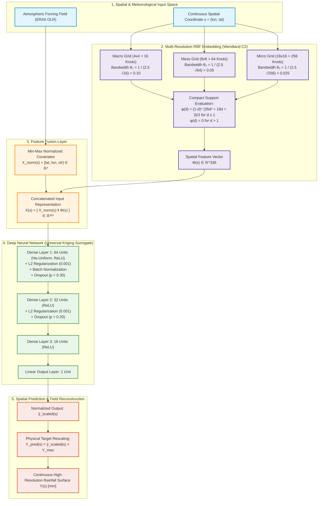

# Methodology: The Hybrid DeepKriging Framework and Computational Architecture

## 1. Theoretical Architecture of DeepKriging (Geostatistical Framework)

### 1.1 From Classical Kriging to DeepKriging: Mathematical Reformulation
In classical spatial statistics, spatial interpolation over a continuous spatial domain $\mathcal{D} \subset \mathbb{R}^2$ is typically modeled as a Gaussian spatial process. Let $Y(\mathbf{s})$ denote the target environmental variable (e.g., monthly rainfall) observed at spatial coordinate $\mathbf{s} = (\mathrm{lon}, \mathrm{lat}) \in \mathcal{D}$. Classical Universal Kriging assumes the spatial process can be decomposed into a deterministic spatial trend (drift) and a zero-mean intrinsically stationary spatial error:

$$
Y(\mathbf{s}) = \sum_{j=1}^p \beta_j f_j(\mathbf{s}) + Z(\mathbf{s}) + \varepsilon(\mathbf{s})
$$

where $f_j(\mathbf{s})$ represent known spatial basis functions or exogenous covariates, $\beta_j$ are regression coefficients, $Z(\mathbf{s})$ is a second-order stationary Gaussian random field characterized by a spatial covariance function $C(\mathbf{s}_i, \mathbf{s}_j) = \mathrm{Cov}(Z(\mathbf{s}_i), Z(\mathbf{s}_j))$, and $\varepsilon(\mathbf{s}) \sim \mathcal{N}(0, \tau^2)$ is independent measurement error (nugget effect).

Despite its theoretical optimality as the Best Linear Unbiased Predictor (BLUP), classical Kriging suffers from two fundamental bottlenecks in hydro-meteorological applications:
1. **Computational Complexity**: Computing the Kriging weights requires inverting an $N \times N$ spatial covariance matrix, yielding a computational complexity of $\mathcal{O}(N^3)$, which becomes intractable as the number of observation points $N$ scales.
2. **Linearity and Stationarity Constraints**: Classical Kriging relies on linear combinations of observations and commonly presumes stationary, isotropic variogram models, failing to capture complex, non-linear physical interactions between non-stationary meteorological fields and atmospheric forcings.

The **DeepKriging** framework (Chen et al., 2020) overcomes these limitations by reformulating spatial interpolation as a supervised deep learning task. Rather than parameterizing spatial dependence through an explicit $N \times N$ covariance matrix, DeepKriging constructs a rich, multi-resolution spatial feature embedding $\boldsymbol{\phi}(\mathbf{s}) \in \mathbb{R}^K$. Combined with exogenous atmospheric covariates $\mathbf{x}(\mathbf{s}) \in \mathbb{R}^M$, the non-linear spatial regression problem is formulated as:

$$
Y(\mathbf{s}) = \mathcal{F}_{\mathbf{W}, \mathbf{b}} \Big( \big[ \mathbf{x}(\mathbf{s}), \boldsymbol{\phi}(\mathbf{s}) \big] \Big) + \varepsilon(\mathbf{s})
$$

where $\mathcal{F}_{\mathbf{W}, \mathbf{b}}(\cdot)$ represents a parameterized deep feedforward neural network with weight tensors $\mathbf{W}$ and bias vectors $\mathbf{b}$. By universal approximation theorems, the deep network can flexibly learn both the large-scale non-linear drift and localized spatial covariance structures simultaneously.

---

### 1.2 Multi-Resolution Spatial Basis Functions (Wendland $C^2$)
To enable the neural network to perceive continuous spatial geometry without being constrained by the Cartesian biases of raw $(\mathrm{lon}, \mathrm{lat})$ coordinates, the spatial domain is projected into a multi-resolution space using compactly supported Radial Basis Functions (RBF). 

The spatial domain covering Java Island is discretized into $L = 3$ hierarchical, nested grid levels with reference knot sets $\mathcal{K}_l = \{ \mathbf{k}_{l,1}, \mathbf{k}_{l,2}, \dots, \mathbf{k}_{l,n_l} \}$ for $l \in \{1, 2, 3\}$:
- **Macro-scale ($l=1$)**: $n_1 = 4 \times 4 = 16$ knots, capturing regional macro-climatic gradients.
- **Meso-scale ($l=2$)**: $n_2 = 8 \times 8 = 64$ knots, capturing sub-regional orographic spatial patterns.
- **Micro-scale ($l=3$)**: $n_3 = 16 \times 16 = 256$ knots, resolving local micro-climatic fluctuations.

The total number of potential basis knots across all levels is $K_{\mathrm{total}} = \sum_{l=1}^3 n_l = 16 + 64 + 256 = 336$.

For any spatial location $\mathbf{s}$, coordinates are first normalized to the unit interval $[0, 1]^2$ based on the spatial bounding box of the observation network:

$$
\mathrm{norm}_{\mathrm{lon}}(\mathbf{s}) = \frac{\mathrm{lon}(\mathbf{s}) - \min(\mathrm{lon}_{\mathrm{obs}})}{\max(\mathrm{lon}_{\mathrm{obs}}) - \min(\mathrm{lon}_{\mathrm{obs}})}, \quad \mathrm{norm}_{\mathrm{lat}}(\mathbf{s}) = \frac{\mathrm{lat}(\mathbf{s}) - \min(\mathrm{lat}_{\mathrm{obs}})}{\max(\mathrm{lat}_{\mathrm{obs}}) - \min(\mathrm{lat}_{\mathrm{obs}})}
$$

For each resolution level $l$, the bandwidth (scale parameter) $\theta_l$ is governed by the knot density:

$$
\theta_l = \frac{1}{2.5 \sqrt{n_l}}
$$

The standardized spatial distance $d_{l, k}(\mathbf{s})$ between observation point $\mathbf{s}$ and reference knot $\mathbf{k}_{l, k}$ is computed as:

$$
d_{l, k}(\mathbf{s}) = \frac{\| \mathbf{s}_{\mathrm{norm}} - \mathbf{k}_{l, k} \|_2}{\theta_l}
$$

The spatial embedding value is evaluated using the positive-definite **Wendland $C^2$** compactly supported radial kernel (Wendland, 1995):

$$
\phi_{l, k}(\mathbf{s}) = 
\begin{cases} 
\dfrac{(1 - d_{l, k}(\mathbf{s}))^6 \big(35 d_{l, k}(\mathbf{s})^2 + 18 d_{l, k}(\mathbf{s}) + 3\big)}{3}, & \text{if } 0 \le d_{l, k}(\mathbf{s}) \le 1 \\
0, & \text{if } d_{l, k}(\mathbf{s}) > 1 
\end{cases}
$$

The compact support property ($d > 1 \implies \phi = 0$) ensures that each knot operates strictly within a localized spatial neighborhood. This induces sparsity in the feature matrix, respects Tobler's First Law of Geography ("near things are more related than distant things"), and guarantees numerical stability by avoiding the dense matrix ill-conditioning typical of Gaussian or multiquadric RBFs. Knots that evaluate to zero across all observation points are eliminated, yielding an active spatial embedding vector $\boldsymbol{\phi}(\mathbf{s}) \in \mathbb{R}^{K}$.

---

### 1.3 Exogenous Atmospheric Forcing Integration (ERA5 OLR)
Rainfall generation is not solely a function of geographic coordinates; it is fundamentally driven by thermodynamical and atmospheric dynamics. To furnish the model with physical meteorological context, the framework incorporates Outgoing Longwave Radiation (OLR) obtained from the European Centre for Medium-Range Weather Forecasts (ECMWF) ERA5 reanalysis dataset (Hersbach et al., 2020). 

OLR ($\mathrm{W/m}^2$) measures the total thermal radiation emitted from the Earth system into space and acts as a physical proxy for cloud-top height and convective activity: lower OLR values indicate deep, high-reaching convective cloud decks associated with intense tropical precipitation, whereas high OLR values indicate clear-sky or suppressed convective conditions.

The exogenous covariate vector is denoted as:

$$
\mathbf{x}(\mathbf{s}) = \big[ \mathrm{lat}(\mathbf{s}), \, \mathrm{lon}(\mathbf{s}), \, \mathrm{OLR}(\mathbf{s}) \big]^T
$$

Prior to ingestion, each exogenous dimension is normalized via Min-Max scaling fitted exclusively on the training partition to prevent data leakage:

$$
\mathbf{x}_{\mathrm{norm}, i}(\mathbf{s}) = \frac{\mathbf{x}_i(\mathbf{s}) - \min(\mathbf{x}_{i, \mathrm{train}})}{\max(\mathbf{x}_{i, \mathrm{train}}) - \min(\mathbf{x}_{i, \mathrm{train}})}
$$

The final input feature vector ingested by the neural network is the horizontal concatenation of the scaled atmospheric covariates and the multi-resolution spatial basis embeddings:

$$
\mathbf{X}(\mathbf{s}) = \Big[ \mathbf{x}_{\mathrm{norm}}(\mathbf{s}) \, \Big\| \, \boldsymbol{\phi}(\mathbf{s}) \Big] \in \mathbb{R}^{M + K}
$$

---

### 1.4 Deep Neural Network Topology and Regularization
The regression mapping $\mathcal{F}_{\mathbf{W}, \mathbf{b}}: \mathbb{R}^{M + K} \to \mathbb{R}$ is implemented as a specialized deep feedforward neural network comprising three hidden dense layers with a funnel-shaped compression architecture:

1. **Input Convergence Layer**: Ingests the fused vector $\mathbf{X}(\mathbf{s})$.
2. **Hidden Layer 1**: 64 neurons with He-uniform weight initialization, Rectified Linear Unit (ReLU) activation, $L_2$ weight regularization ($\lambda = 0.001$), Batch Normalization, and Dropout with rate $p_1 = 0.3$.
3. **Hidden Layer 2**: 32 neurons, ReLU activation, $L_2$ weight regularization ($\lambda = 0.001$), and Dropout with rate $p_2 = 0.2$.
4. **Hidden Layer 3**: 16 neurons, ReLU activation.
5. **Output Layer**: 1 neuron with a linear activation function yielding the normalized scalar prediction $\hat{y}_{\mathrm{scaled}}(\mathbf{s})$.

The mathematical propagation across the network layers is defined as:

$$
\begin{aligned}
\mathbf{h}_1 &= \mathrm{Dropout}_{0.3} \Big( \mathrm{BatchNorm} \big( \mathrm{ReLU}(\mathbf{X} \mathbf{W}_1 + \mathbf{b}_1) \big) \Big) \\
\mathbf{h}_2 &= \mathrm{Dropout}_{0.2} \Big( \mathrm{ReLU}(\mathbf{h}_1 \mathbf{W}_2 + \mathbf{b}_2) \Big) \\
\mathbf{h}_3 &= \mathrm{ReLU}(\mathbf{h}_2 \mathbf{W}_3 + \mathbf{b}_3) \\
\hat{y}_{\mathrm{scaled}} &= \mathbf{h}_3 \mathbf{W}_{\mathrm{out}} + b_{\mathrm{out}}
\end{aligned}
$$

The network parameters are optimized by minimizing the regularized Mean Squared Error (MSE) objective function:

$$
\mathcal{L}_{\mathrm{train}}(\mathbf{W}, \mathbf{b}) = \frac{1}{N_{\mathrm{train}}} \sum_{i=1}^{N_{\mathrm{train}}} \left( y_{\mathrm{scaled}}(\mathbf{s}_i) - \hat{y}_{\mathrm{scaled}}(\mathbf{s}_i) \right)^2 + \lambda \sum_{l=1}^2 \|\mathbf{W}_l\|_F^2
$$

using the Adam optimizer with a learning rate $\eta = 5 \times 10^{-4}$ and mini-batch size $B = 16$.

*Figure 1: Interpreting the DeepKriging Neural Network Architecture. The input layer simultaneously ingests $p$ exogenous meteorological covariates $\mathbf{x} = [x_1, \dots, x_p]^T$ (latitude, longitude, OLR) and $K$ multi-resolution Wendland $C^2$ spatial basis function embeddings $\boldsymbol{\phi} = [\phi_1, \dots, \phi_K]^T$. Dense, fully connected hidden layers sequentially compress representations (64 $\to$ 32 $\to$ 16 units) before generating the continuous precipitation estimate $\hat{y}$ at the linear output layer.*

---

### 1.5 DeepKriging Theoretical Architecture Flowchart

*Figure 2: Conceptual Geostatistical Architecture of the Hybrid DeepKriging Framework.*

---

## 2. Computational Implementation and Algorithmic Architecture (Coding Pipeline)

The programmatic implementation of the framework is encapsulated within the execution pipeline `kode2026_1var_recordloss5_newbasis.py`. This section details the complete software lifecycle, procedural workflows, and execution controls designed for robust monthly rainfall modeling across Java Island.

### 2.1 Spatial Data Matching via KDTree and Grid Cell Aggregation
Surface rainfall observations collected from physical rain gauges are point-referenced and distributed irregularly across complex terrain. In contrast, the ERA5 reanalysis covariates are discretized on an orthogonal geographic grid at a spatial resolution of $0.25^\circ \times 0.25^\circ$.

To reconcile these differing spatial structures without introducing geographic distortion, the pipeline employs a multi-step spatial pairing procedure:
1. **KDTree Construction**: A 2D spatial search tree (`scipy.spatial.KDTree`) is constructed over the ERA5 grid coordinates $\mathbf{G} = \{ (\mathrm{lon}_j, \mathrm{lat}_j) \}_{j=1}^{N_{\mathrm{grid}}}$.
2. **Nearest-Neighbor Query**: For every station coordinate $\mathbf{s}_i^{\mathrm{obs}} = (\mathrm{long}_i, \mathrm{lat}_i)$, the tree efficiently queries the nearest grid node index:
   $$
   j^*(i) = \arg\min_j \| \mathbf{s}_i^{\mathrm{obs}} - \mathbf{G}_j \|_2
   $$
3. **Sub-Grid Cell Aggregation**: In instances where multiple surface gauge stations fall within the capture basin of the identical $0.25^\circ$ grid cell $j^*$, their precipitation values are aggregated using an arithmetic mean:
   $$
   \bar{Y}_{j^*} = \frac{1}{|\mathcal{S}_{j^*}|} \sum_{i \in \mathcal{S}_{j^*}} Y(\mathbf{s}_i^{\mathrm{obs}})
   $$
   where $\mathcal{S}_{j^*} = \{ i : j^*(i) = j^* \}$.
4. **Matched Base Dataset Export**: The merged dataframe containing grid coordinates, matched exogenous ERA5 features, and aggregated observed rainfall is exported to disk as `DF_PADAN_{month}_{year}.csv`.

---

### 2.2 Deterministic Spatial Holdout Masking for Out-of-Sample Validation
Standard random train-test splitting (e.g., $k$-fold cross-validation) is fundamentally flawed when applied to spatial processes because strong spatial autocorrelation causes data leakage: training and testing points in close geographic proximity share redundant information, leading to overly optimistic accuracy metrics.

To rigorously evaluate the model's true out-of-sample spatial generalizability across unmonitored geographic regimes, the pipeline implements a **Deterministic Spatial Holdout Masking** protocol. Nine geographically dispersed grid coordinates across West, Central, and East Java are isolated as a static testing set $\mathcal{D}_{\mathrm{test}}$:

| Station ID / Location Index | Longitude ($^\circ\mathrm{E}$) | Latitude ($^\circ\mathrm{S}$) | Geographic Zone |
| :---: | :---: | :---: | :---: |
| 1 | 106.50 | -6.25 | West Java (Northern Lowland) |
| 2 | 107.00 | -6.75 | West Java (Mountainous Interior) |
| 3 | 112.25 | -7.00 | East Java (Northern Coastal) |
| 4 | 110.00 | -7.00 | Central Java (Northern Coast) |
| 5 | 107.50 | -7.25 | West Java (Southern Highlands) |
| 6 | 110.00 | -7.50 | Central Java (Interior Valley) |
| 7 | 111.75 | -7.75 | East Java (Central Basin) |
| 8 | 113.50 | -8.00 | East Java (Eastern Plateau) |
| 9 | 112.25 | -8.25 | East Java (Southern Coast) |

All remaining paired observation locations form the training set $\mathcal{D}_{\mathrm{train}} = \mathcal{D} \setminus \mathcal{D}_{\mathrm{test}}$.

---

### 2.3 Feature Transformation, Scaling, and Target Normalization
To ensure consistent gradient flow during stochastic optimization:
1. **Covariate Min-Max Scaling**: The exogenous feature matrix for the training set $\mathbf{X}_{\mathrm{train}}^{\mathrm{cov}}$ is normalized column-wise to $[0, 1]$. The identical minimum and maximum parameters derived from $\mathcal{D}_{\mathrm{train}}$ are subsequently applied to the testing set $\mathbf{X}_{\mathrm{test}}^{\mathrm{cov}}$ and the full grid $\mathbf{X}_{\mathrm{full}}^{\mathrm{cov}}$.
2. **Wendland $C^2$ Spatial Basis Generation**: The function `build_rbf_basis` evaluates basis activations across all grid points and extracts rows corresponding to training indices ($\mathbf{\Phi}_{\mathrm{train}}$) and testing indices ($\mathbf{\Phi}_{\mathrm{test}}$). Inactive basis columns (where $\sum_i \phi_{:, k} = 0$) are pruned from memory.
3. **Feature Tensor Concatenation**:
   $$
   \mathbf{X}_{\mathrm{train}}^{\mathrm{final}} = \left[ \mathbf{X}_{\mathrm{train}}^{\mathrm{cov}} \, \Big\| \, \mathbf{\Phi}_{\mathrm{train}} \right], \quad \mathbf{X}_{\mathrm{test}}^{\mathrm{final}} = \left[ \mathbf{X}_{\mathrm{test}}^{\mathrm{cov}} \, \Big\| \, \mathbf{\Phi}_{\mathrm{test}} \right]
   $$
4. **Target Normalization**: Observed rainfall values are normalized by the maximum training rainfall $Y_{\mathrm{max}} = \max(\mathbf{y}_{\mathrm{train0}})$:
   $$
   y_{\mathrm{train}} = \frac{\mathbf{y}_{\mathrm{train0}}}{Y_{\mathrm{max}}}, \quad y_{\mathrm{test}} = \frac{\mathbf{y}_{\mathrm{test0}}}{Y_{\mathrm{max}}}
   $$

---

### 2.4 Iterative Training Loop, Dynamic Unit Rescaling, and Stopping Criteria
Rather than invoking black-box training calls, the pipeline employs an explicit single-epoch loop (`while epochs < MAX_EPOCHS and mae_last > MAE_TARGET`) to enable granular per-epoch tracking of training and testing metrics:
1. **Single-Epoch Fit**: `model.fit(X_train_final, y_train, epochs=1, batch_size=16, verbose=0)`.
2. **Out-of-Sample Evaluation**: `model.evaluate(X_test_final, y_test, verbose=0)` computes current test loss and test MAE on the held-out spatial stations.
3. **Metric Unit Inversion**: Because training operates on dimensionless quantities scaled by $Y_{\mathrm{max}}$, the pipeline dynamically inverts metrics back to physical units at every epoch:
   $$
   \mathrm{MAE}_{\mathrm{physical}} = \mathrm{MAE}_{\mathrm{scaled}} \times Y_{\mathrm{max}} \quad [\mathrm{mm}]
   $$
   $$
   \mathrm{Loss}_{\mathrm{physical}} = \mathrm{Loss}_{\mathrm{scaled}} \times (Y_{\mathrm{max}})^2 \quad [\mathrm{mm}^2]
   $$
4. **Convergence Monitoring**: The loop iterates until either the maximum epoch threshold (`MAX_EPOCHS = 10000`) is reached or the training MAE drops below the convergence criterion (`MAE_TARGET = 0.000002`).
5. **History Serialization**: The full trajectory of training and testing metrics across all epochs is exported to `HISTORY_METRICS_{month}_{year}.csv`, and dual learning curves (MAE and MSE Loss) are rendered to `METRICS_CURVE_{month}_{year}.png`.

---

### 2.5 Full Domain Spatial Inference and Export Pipeline
Following model convergence, spatial inference is performed across the entire continuous geographic grid:
1. **Full Grid Feature Stack**: The normalized covariate matrix for the entire Java domain $\mathbf{X}_{\mathrm{full}}^{\mathrm{cov}}$ is stacked with the complete basis matrix $\mathbf{\Phi}_{\mathrm{all}}$:
   $$
   \mathbf{X}_{\mathrm{full}}^{\mathrm{final}} = \left[ \mathbf{X}_{\mathrm{full}}^{\mathrm{cov}} \, \Big\| \, \mathbf{\Phi}_{\mathrm{all}} \right]
   $$
2. **Forward Inference**: The trained network predicts the normalized precipitation ratio $\hat{\mathbf{y}}_{\mathrm{full}} = \mathrm{Model.predict}(\mathbf{X}_{\mathrm{full}}^{\mathrm{final}})$.
3. **Physical Dimensionalization**: Predictions are restored to physical rainfall units:
   $$
   \mathbf{Y}_{\mathrm{pred}} = \hat{\mathbf{y}}_{\mathrm{full}} \times Y_{\mathrm{max}} \quad [\mathrm{mm}]
   $$
4. **Spatial CSV Generation**: Coordinates $(\mathrm{lon}_j, \mathrm{lat}_j)$ and predicted rainfall $\mathrm{ch\_pred}_j$ are exported to `HASIL_ch_pred_{month}-{year}.csv`, providing the final interpolated surface ready for cartographic GIS visualization.

---

### 2.6 Algorithmic Pipeline Flowchart

```mermaid
flowchart TD
    classDef io fill:#fff8e1,stroke:#ffa000,stroke-width:2px;
    classDef proc fill:#e3f2fd,stroke:#1976d2,stroke-width:2px;
    classDef decision fill:#fce4ec,stroke:#c2185b,stroke-width:2px;
    classDef term fill:#e0f2f1,stroke:#00796b,stroke-width:2px;

    Start(["Start: run_for_month(YEAR, MONTH)"]):::term --> ReadFiles[/"Read Observation File (sum_bulanan_rainfall_1.txt)<br/>Read ERA5 Excel (processed_era5jawa_YYYY_MM.xlsx)"/]:::io

    ReadFiles --> KDTree["scipy.spatial.KDTree:<br/>Index ERA5 Grid (lon, lat)<br/>Query Nearest Grid Node for Each Station"]:::proc
    KDTree --> Aggregate["Cell-Wise Aggregation:<br/>df_obs.groupby('neighbor')[['monthly_rainfall']].mean()"]:::proc
    Aggregate --> SavePadan[/"Write Matched Dataset:<br/>DF_PADAN_MONTH_YEAR.csv"/]:::io

    SavePadan --> SpatialSplit{"Spatial Masking:<br/>(lon, lat) ∈ 9 Holdout Points?"}:::decision
    SpatialSplit -->|"True"| TestSet[/"Test Partition (df_test):<br/>9 Unseen Spatial Locations"/]:::io
    SpatialSplit -->|"False"| TrainSet[/"Train Partition (df_train):<br/>Remaining Spatial Locations"/]:::io

    TrainSet --> ScaleCov["Min-Max Normalization (Covariates):<br/>Fit lo, hi on Train Set;<br/>Transform Train, Test, and Full Grid"]:::proc
    TrainSet --> GenRBF["Construct Multi-Resolution Wendland C2 Basis:<br/>Levels: 4x4, 8x8, 16x16 (336 Knots)<br/>Bandwidth: θ = 1 / (2.5 √n)"]:::proc

    ScaleCov & GenRBF --> Concat["Feature Concatenation:<br/>X_train = [X_train_cov ‖ Φ_train]<br/>X_test  = [X_test_cov  ‖ Φ_test]"]:::proc
    Concat --> ScaleY["Target Normalization:<br/>Y_max = max(y_train0)<br/>y_train = y_train0 / Y_max<br/>y_test  = y_test0 / Y_max"]:::proc

    ScaleY --> InitDNN["Initialize Sequential DNN:<br/>Dense(64, He-Uniform, L2=0.001) -> BN -> Drop(0.3)<br/>Dense(32, L2=0.001) -> Drop(0.2)<br/>Dense(16) -> Dense(1, Linear)<br/>Optimizer: Adam(lr=0.0005), Loss: MSE"]:::proc

    InitDNN --> FitLoop["Train 1 Epoch (batch_size=16)<br/>Evaluate on Test Set (model.evaluate)<br/>Convert Metrics to Physical Units:<br/>MAE_mm = MAE_scaled × Y_max<br/>Loss_mm2 = Loss_scaled × (Y_max)²"]:::proc

    FitLoop --> CheckStop{"Stopping Criteria:<br/>epoch ≥ 10000 OR<br/>MAE_scaled ≤ 0.000002?"}:::decision
    CheckStop -->|"No"| FitLoop
    CheckStop -->|"Yes"| SaveMetrics[/"Write History & Curves:<br/>• HISTORY_METRICS_MONTH_YEAR.csv<br/>• METRICS_CURVE_MONTH_YEAR.png"/]:::io

    SaveMetrics --> FullInference["Full Domain Grid Prediction:<br/>X_full = [X_full_cov ‖ Φ_all]<br/>ŷ_full = Model.predict(X_full)<br/>Y_pred = ŷ_full × Y_max"]:::proc

    FullInference --> SavePred[/"Write Final Predictions:<br/>HASIL_ch_pred_MONTH-YEAR.csv<br/>(longitude, latitude, ch_pred)"/]:::io

    SavePred --> End(["End: Process Complete"]):::term
```

*Figure 3: Computational Pipeline and Algorithmic Execution Flowchart (`kode2026_1var_recordloss5_newbasis.py`).*

---

## 3. Comparison of Theoretical Geostatistical Architecture vs. Computational Pipeline

| Architectural Dimension | Theoretical DeepKriging (Geostatistical Model) | Computational Pipeline (`kode2026_1var_recordloss5_newbasis.py`) |
| :--- | :--- | :--- |
| **Primary Objective** | Solve continuous spatial regression $Y(\mathbf{s}) = \mathcal{F}(\mathbf{x}(\mathbf{s}), \boldsymbol{\phi}(\mathbf{s})) + \varepsilon$ without $\mathcal{O}(N^3)$ matrix inversion. | Execute automated end-to-end data ingestion, spatial matching, model training, and continuous surface grid export. |
| **Spatial Discretization** | Continuous spatial coordinates $\mathbf{s} \in \mathbb{R}^2$ mapped to non-Euclidean functional Hilbert space via Wendland $C^2$ kernels. | Discrete 2D KDTree search matching station coordinates to nearest $0.25^\circ \times 0.25^\circ$ regular ERA5 grid nodes. |
| **Spatial Basis Formulation** | Multi-resolution nesting $n \in \{16, 64, 256\}$, bandwidth $\theta_l = (2.5\sqrt{n_l})^{-1}$, compact support guarantee ($d > 1 \implies \phi = 0$). | Numerical evaluation via `np.meshgrid` and matrix vectorization, pruning zero-sum columns (`phi[:, keep]`). |
| **Atmospheric Conditioning** | Integrates physical thermodynamic proxy (OLR) to govern convective precipitation drift. | Loads monthly ERA5 NetCDF/Excel tables, extracts columns `[lat, lon, olr]`, and performs train-fitted Min-Max transformation. |
| **Validation Strategy** | Spatial cross-validation to assess generalization across non-stationary geographical domains. | Deterministic spatial masking of 9 fixed regional coordinates (`points_to_remove`) ensuring rigorous out-of-sample evaluation. |
| **Loss & Convergence** | Regularized empirical risk minimization: $\mathcal{L}_{\mathrm{MSE}} + \lambda \|\mathbf{W}\|_2^2$. | Per-epoch step evaluation tracking physical units ($\mathrm{mm}, \mathrm{mm}^2$), early termination on `MAE_TARGET = 0.000002` or `10000` epochs. |
| **Output Delivery** | Continuous spatial prediction surface $\hat{Y}(\mathbf{s})$ over domain $\mathcal{D}$. | Structured files: `DF_PADAN_*.csv`, `HISTORY_METRICS_*.csv`, `METRICS_CURVE_*.png`, and `HASIL_ch_pred_*.csv`. |

---

## 4. Hyperparameter Summary and Technical Specifications

| Parameter Category | Hyperparameter / Technical Specification | Numerical Value / Configuration |
| :--- | :--- | :--- |
| **Spatial Resolution** | ERA5 Grid Cell Spacing | $0.25^\circ \times 0.25^\circ$ ($\approx 27.75\mathrm{~km}$ at equator) |
| **RBF Basis Functions** | Basis Kernel Family | Compactly Supported Wendland $C^2$ |
| | Resolution Hierarchy ($L=3$) | Level 1: $4 \times 4 = 16$; Level 2: $8 \times 8 = 64$; Level 3: $16 \times 16 = 256$ |
| | Total Potential Knot Count | $K_{\mathrm{total}} = 336$ knots |
| | Bandwidth Scale Parameter ($\theta_l$) | $\theta_1 = 0.100, \, \theta_2 = 0.050, \, \theta_3 = 0.025$ |
| **Exogenous Features** | Atmospheric Forcing Covariates | Latitude, Longitude, Outgoing Longwave Radiation (`olr`) |
| **Neural Architecture** | Total Hidden Layers | 3 Dense Layers (Funnel: $64 \to 32 \to 16$) |
| | Activation Functions | Hidden: ReLU; Output: Linear |
| | Weight Initialization | He-Uniform (`he_uniform`) |
| | Regularization Penalties | $L_2$ Weight Penalty ($\lambda = 0.001$) on Layers 1 & 2 |
| | Internal Normalization | Batch Normalization (Layer 1 post-activation) |
| | Dropout Regularization | Layer 1: $p = 0.30$ (30%); Layer 2: $p = 0.20$ (20%) |
| **Optimization** | Loss Objective | Mean Squared Error (MSE) |
| | Optimizer Algorithm | Adam ($\beta_1 = 0.9, \, \beta_2 = 0.999, \, \epsilon = 10^{-7}$) |
| | Learning Rate ($\eta$) | $5 \times 10^{-4}$ ($0.0005$) |
| | Batch Size ($B$) | 16 samples per mini-batch |
| | Convergence Criteria | $\mathrm{MAE}_{\mathrm{scaled}} \le 2 \times 10^{-6}$ or $\mathrm{Epochs} = 10000$ |
| **Validation Strategy** | Spatial Holdout Set | 9 Fixed Station Coordinates across West, Central, and East Java |
