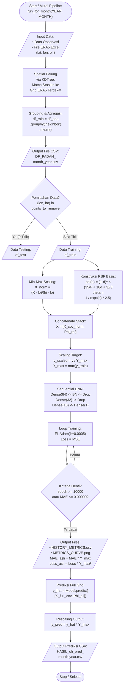
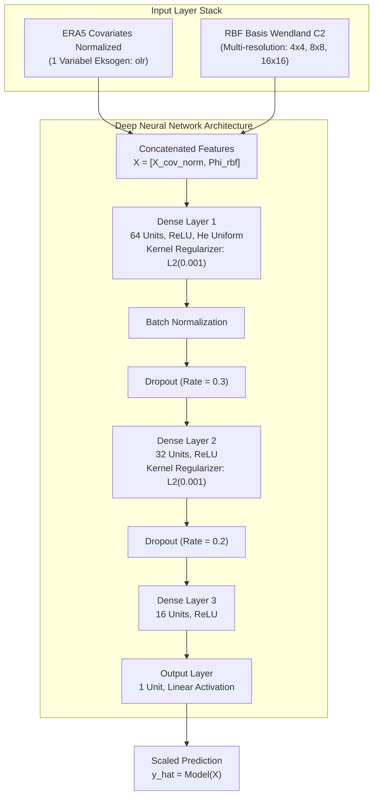
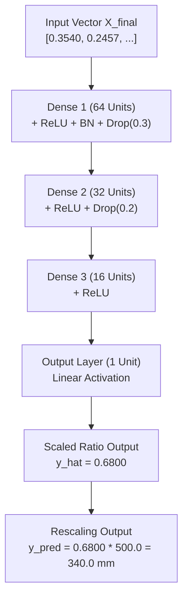

# Dokumentasi Arsitektur Model DeepKriging-Hybrid (1-Var OLR - Ver 5)

Dokumentasi ini menjelaskan secara menyeluruh arsitektur, basis matematis, alur pemrosesan data, serta struktur model jaringan saraf tiruan (DNN) yang diimplementasikan pada skrip [`kode2026_1var_recordloss5_newbasis.py`](file:///home/deepkriging/tsaqib/1_2026_DKNEW/1var_olr/kode2026_1var_recordloss5_newbasis.py).

---

## 1. Ringkasan Eksekutif & Konsep Dasar

Model ini menerapkan metode **DeepKriging-Hybrid**, yaitu penggabungan antara **Radial Basis Functions (RBF)** spasial multi-resolusi berbasis struktur kovarians **Wendland $C^2$** dengan **Deep Neural Network (DNN)** yang memanfaatkan variabel atmosferik eksogen dari reanalisis ERA5.

### Tujuan Utama
Melakukan interpolasi spasial dan prediksi curah hujan bulanan (*monthly rainfall* dalam mm) di seluruh wilayah Pulau Jawa berbasis data observasi permukaan dan covariate ERA5.

### Karakteristik Kunci Model
- **Input Kovariat Eksogen**: 1 variabel atmosferik ERA5 (`olr`) + koordinat geografis (`lat`, `lon`).
- **Fungsi Basis Spasial**: RBF Wendland $C^2$ berdukungan kompak (*compact support*) pada 3 tingkat resolusi ($4^2=16$, $8^2=64$, $16^2=256$).
- **Metode Pairing Spasial**: Pemasangan koordinat stasiun observasi ke grid terdekat ERA5 menggunakan **KDTree**.
- **Normalisasi Lanjutan**: Skala target dipetakan terhadap nilai maksimum $Y_{\mathrm{max}}$, dan variabel eksogen dinormalisasi Min-Max berdasarkan subset *training*.

---

## 2. Alur Eksekusi & Flowchart (Mermaid Diagrams)

Legenda Bentuk Standar Flowchart:
- **Oval / Stadium `([])`**: Terminal Start / Stop (Mulai / Selesai).
- **Jajar Genjang `[/ /]`**: Input / Output Data dan Berkas.
- **Persegi Panjang `[ ]`**: Proses Komputasi / Pemrosesan Data.
- **Belah Ketupat `{" "}`**: Keputusan / Percabangan Logika (*Decision*).

### 2.1 Alur Pemrosesan Data & Pipeline Eksekusi (End-to-End)



---

### 2.2 Penjelasan Rinci Setiap Tahap / Box Flowchart

| Kode Node | Bentuk Simbol | Nama Tahap | Deskripsi Detail & Formula Operasi |
| :--- | :--- | :--- | :--- |
| **A** | Oval `([])` | **Start / Mulai** | Inisialisasi fungsi `run_for_month(YEAR, MONTH)` dengan parameter lingkungan (default: `YEAR=2014`, `MONTH=1`). Memulai sesi Keras. |
| **B** | Jajar Genjang `[/ /]` | **Input Data** | Memuat berkas observasi `sum_bulanan_rainfall_1.txt` dan file ERA5 `processed_era5jawa_{year}_{month}.xlsx`. Ekstraksi kolom `lat`, `lon`, `olr`. |
| **C** | Persegi Panjang `[ ]` | **KDTree Pairing** | Mencari tetangga terdekat grid ERA5 untuk setiap stasiun observasi menggunakan algoritma KDTree spasial 2D berdasarkan jarak Euclidean koordinat. |
| **D** | Persegi Panjang `[ ]` | **Agregasi Observasi** | Mengelompokkan stasiun yang terpasang pada grid node yang sama dengan operasi rerata: `df_rain = df_obs.groupby("neighbor")[["monthly_rainfall"]].mean()`. |
| **E** | Jajar Genjang `[/ /]` | **Export DF_PADAN** | Menyimpan dataset hasil pairing lengkap yang berisi nilai observasi dan variabel eksogen ERA5 ke berkas `DF_PADAN_{month}_{year}.csv`. |
| **F** | Belah Ketupat `{" "}` | **Pemisahan Masking** | Evaluasi kondisi percabangan spasial: apakah koordinat `(lon, lat)` termasuk dalam daftar 9 titik *testing* (`points_to_remove`). |
| **G** | Jajar Genjang `[/ /]` | **Data Testing** | Subset titik yang cocok dengan 9 koordinat uji dipisahkan ke dataframe `df_test` untuk validasi independen. |
| **H** | Jajar Genjang `[/ /]` | **Data Training** | Sisa titik observasi dipisahkan ke dataframe `df_train` sebagai data latih model. |
| **I** | Persegi Panjang `[ ]` | **Min-Max Scaling Kovariat** | Fitur atmosferik OLR dinormalisasi ke rentang $[0, 1]$ berdasarkan nilai minimum ($\mathrm{lo}$) dan maksimum ($\mathrm{hi}$) data training: <code>X<sub>norm</sub> = (X - lo) / (hi - lo)</code>. |
| **J** | Persegi Panjang `[ ]` | **Konstruksi RBF Basis** | Pembentukan matriks basis spasial RBF Wendland $C^2$ pada 3 resolusi ($16, 64, 256$). Membuang basis yang tidak aktif ($\phi = 0$ di seluruh domain). |
| **K** | Persegi Panjang `[ ]` | **Concatenate Features** | Penggabungan matriks kovariat eksogen ter-skala dengan matriks RBF basis menjadi matriks fitur gabungan: <code>X = [X<sub>cov_norm</sub>, Φ<sub>rbf</sub>]</code>. |
| **L** | Persegi Panjang `[ ]` | **Scaling Target** | Target curah hujan dinormalisasi dengan membagi terhadap nilai maksimum target training: <code>y<sub>scaled</sub> = y / Y<sub>max</sub></code>, di mana <code>Y<sub>max</sub> = max(y<sub>train0</sub>)</code>. |
| **M** | Persegi Panjang `[ ]` | **Inisialisasi Model DNN** | Membangun jaringan saraf Sequential 3 layer (64 -> 32 -> 16 -> 1) dengan aktivasi ReLU, Batch Normalization, Dropout (30%, 20%), $L_2$ regularizer (0.001), dan optimizer Adam (learning rate = 0.0005). |
| **N** | Persegi Panjang `[ ]` | **Training Iteratif** | Fitting model epoch demi epoch dengan batch size 16. Evaluasi loss MSE & MAE pada data training dan testing. |
| **O** | Belah Ketupat `{" "}` | **Kriteria Henti** | Pengecekan kondisi henti loop training: apakah `epochs >= 10000` ATAU `MAE_scaled <= 0.000002`. Jika belum, iterasi dilanjutkan. |
| **P** | Jajar Genjang `[/ /]` | **Export History & Grafik** | Mengembalikan metrik ke satuan asli (<code>MAE<sub>asli</sub> = MAE<sub>scaled</sub> × Y<sub>max</sub></code>, <code>Loss<sub>asli</sub> = Loss<sub>scaled</sub> × Y<sub>max</sub>²</code>), menyimpannya ke `HISTORY_METRICS.csv`, dan menggambar `METRICS_CURVE.png`. |
| **Q** | Persegi Panjang `[ ]` | **Prediksi Grid Full** | Mengumpankan seluruh koordinat grid ERA5 Pulau Jawa (beserta RBF basis full $\Phi_{\mathrm{all}}$) ke model terlatih untuk memperoleh output rasio $\hat{y}$. |
| **R** | Persegi Panjang `[ ]` | **Rescaling Output** | Mengalikan kembali output rasio jaringan dengan faktor skala target $Y_{\mathrm{max}}$ untuk mendapatkan prediksi nilai curah hujan asli (mm): <code>y<sub>pred</sub> = ŷ × Y<sub>max</sub></code>. |
| **S** | Jajar Genjang `[/ /]` | **Export Hasil Prediksi** | Menyimpan koordinat `longitude`, `latitude`, dan `ch_pred` ke berkas luaran akhir `HASIL_ch_pred_{month}-{year}.csv`. |
| **T** | Oval `([])` | **Stop / Selesai** | Pipeline pemrosesan bulan selesai dengan sukses. |

---

### 2.3 Arsitektur Detail Jaringan Saraf Tiruan (Deep Neural Network)



---

## 3. Rincian Komponen & Formula Matematika

### 3.1 Variabel Eksogen ERA5
Variabel yang diekstrak dari dataset bulanan ERA5 (`EKSOGEN_COLS`):
1. **`lat`**: Garis Lintang
2. **`lon`**: Garis Bujur
3. **`olr`**: Outgoing Longwave Radiation ($\mathrm{W/m}^2$)

**Skala Normalisasi (Min-Max)**:

Setiap fitur eksogen $X_{:, i}$ dinormalisasi berdasarkan nilai minimum ($\mathrm{lo}$) dan maksimum ($\mathrm{hi}$) pada data *training*:

$$
X_{\mathrm{norm}, i} = \frac{X_{:, i} - \mathrm{lo}_i}{\mathrm{hi}_i - \mathrm{lo}_i}
$$

---

### 3.2 Fungsi Basis Spasial RBF (Wendland $C^2$) & Vektor Fitur Spasial

#### Apa itu $\phi_1, \phi_2, \dots, \phi_{336}$?
$\phi_i$ adalah **nilai respon basis spasial RBF (Radial Basis Function)** di lokasi observasi tertentu terhadap **titik pusat jangkar spasial (knot center) ke-$i$**. 

Dalam geostatistik konvensional (Kriging), hubungan spasial antar-lokasi dihitung menggunakan matriks kovarians. Pada **DeepKriging**, domain geografis Pulau Jawa "diselimuti" oleh **336 titik jangkar spasial (knots)** yang tersebar secara teratur pada 3 resolusi gridding multi-skala:

1. **Resolusi 1 ($4 \times 4 = 16$ knots)**: Menangkap variasi spasial skala makro / regional luas.
2. **Resolusi 2 ($8 \times 8 = 64$ knots)**: Menangkap variasi spasial skala meso / sub-regional.
3. **Resolusi 3 ($16 \times 16 = 256$ knots)**: Menangkap variasi spasial skala mikro / lokal (efek topografi/pantai).

$$\mathrm{NUM}_{\mathrm{basis}} = 16 + 64 + 256 = \mathbf{336\text{ basis spasial}}$$

Setiap lokasi stasiun $(lon, lat)$ memiliki **vektor sidik jari spasial unik** $\Phi_{\mathrm{rbf}} = [\phi_1, \phi_2, \dots, \phi_{336}]$ yang diumpankan ke jaringan saraf tiruan (DNN).

---

#### Parameter & Formula Perhitungan Wendland $C^2$:

**1. Normalisasi Koordinat Spasial**:

$$
\mathrm{norm}_{\mathrm{lon}} = \frac{\mathrm{lon} - \min(\mathrm{lon}_{\mathrm{obs}})}{\max(\mathrm{lon}_{\mathrm{obs}}) - \min(\mathrm{lon}_{\mathrm{obs}})}, \quad \mathrm{norm}_{\mathrm{lat}} = \frac{\mathrm{lat} - \min(\mathrm{lat}_{\mathrm{obs}})}{\max(\mathrm{lat}_{\mathrm{obs}}) - \min(\mathrm{lat}_{\mathrm{obs}})}
$$

**2. Parameter Jangkauan (Scale / Bandwidth $\theta$)**:

Untuk setiap resolusi $n \in \{16, 64, 256\}$, batas jangkauan pengaruh knot ditentukan oleh:

$$
\theta = \frac{1}{\sqrt{n} \times 2.5}
$$

**3. Jarak Terbobot ke Pusat Knot (Scalability Distance $d$)**:

Jarak Euclidean dari titik lokasi stasiun $(\mathrm{norm}_{\mathrm{lon}}, \mathrm{norm}_{\mathrm{lat}})$ ke pusat knot ke-$i$ yaitu $(x_k, y_k)$:

$$
d_i = \frac{\sqrt{(\mathrm{norm}_{\mathrm{lon}} - x_k)^2 + (\mathrm{norm}_{\mathrm{lat}} - y_k)^2}}{\theta}
$$

**4. Fungsi Basis Wendland $C^2$ Berdukungan Kompak (*Compact Support*)**:

$$
\phi_i(d) = \begin{cases} \frac{(1 - d)^6 (35 d^2 + 18 d + 3)}{3}, & \text{jika } 0 \le d \le 1 \\ 0, & \text{jika } d > 1 \end{cases}
$$

*Sifat Compact Support*: Jika jarak stasiun ke pusat knot $d_i > 1$ (di luar radius jangkauan $\theta$), nilai basis bernilai **tepat $0$**. Hanya knot yang berada dekat dengan stasiun yang memberikan nilai respon positif ($\phi_i > 0$).

Fungsi basis yang bernilai $0$ di seluruh domain dieliminasi untuk efisiensi komputasi.

---

### 3.3 Pemisahan Data Training & Testing (Spatial Masking)

Pemisahan data tidak dilakukan secara acak, melainkan dengan menentukan 9 titik koordinat tertentu sebagai data uji spasial (*testing set*) untuk mengevaluasi akurasi generasi spasial model:
- `(106.5, -6.25)`
- `(107.0, -6.75)`
- `(112.25, -7.0)`
- `(110.0, -7.0)`
- `(107.5, -7.25)`
- `(110.0, -7.5)`
- `(111.75, -7.75)`
- `(113.5, -8.0)`
- `(112.25, -8.25)`

Titik yang cocok dipisahkan ke `df_test`, sedangkan sisa titik dijadikan `df_train`.

---

### 3.4 Detail Lapisan & Hyperparameter Neural Network

| Layer / Komponen | Tipe Layer / Fungsi | Konfigurasi / Hyperparameter | Tujuan & Keterangan |
| :--- | :--- | :--- | :--- |
| **Input Feature Stack** | Concatenation | $X = [X_{\mathrm{cov,norm}}, \Phi_{\mathrm{rbf}}]$ | Memadukan fitur atmosferik & basis spasial |
| **Layer 1** | `Dense` | 64 unit, Aktivasi `ReLU`, `he_uniform` | Feature extraction non-linear awal |
| **Regularisasi 1** | `l2(0.001)` | $L_2$ weight penalty | Mencegah overfitting |
| **Batch Normalization** | `BatchNormalization` | Default Keras settings | Menstabilkan distribusi gradien antar epoch |
| **Dropout 1** | `Dropout` | Rate = 0.3 (30%) | Mengurangi ketergantungan antar neuron |
| **Layer 2** | `Dense` | 32 unit, Aktivasi `ReLU` | Abstraksi tingkat menengah |
| **Regularisasi 2** | `l2(0.001)` | $L_2$ weight penalty | Pengendalian bobot jaringan |
| **Dropout 2** | `Dropout` | Rate = 0.2 (20%) | Regularisasi tambahan |
| **Layer 3** | `Dense` | 16 unit, Aktivasi `ReLU` | Kompresi fitur sebelum regresi akhir |
| **Output Layer** | `Dense` | 1 unit, Aktivasi `Linear` | Output prediksi rasio curah hujan $\hat{y}$ |
| **Optimizer** | `Adam` | Learning Rate = 0.0005 | Optimasi stokastik berbasis momen |
| **Loss Function** | `MSE` | Mean Squared Error | Minimasi kuadrat eror |
| **Metrik Tambahan** | `MAE` | Mean Absolute Error | Evaluasi rata-rata magnitudo eror |

---

### 3.5 Skaling Target & Penyesuaian Satuan Metrik

Target curah hujan dinormalisasi:

$$
y_{\mathrm{train}} = \frac{y_{\mathrm{train0}}}{Y_{\mathrm{max}}}, \quad Y_{\mathrm{max}} = \max(y_{\mathrm{train0}})
$$

Pada saat pencatatan sejarah *history*, metrik dikembalikan ke satuan asli (mm):

$$
\mathrm{MAE}_{\mathrm{asli}} = \mathrm{MAE}_{\mathrm{scaled}} \times Y_{\mathrm{max}}
$$

$$
\mathrm{Loss}_{\mathrm{asli}} = \mathrm{Loss}_{\mathrm{scaled}} \times Y_{\mathrm{max}}^2
$$

---

## 4. Parameter Konfigurasi Skrip

Beberapa parameter utama yang dapat dikonfigurasi melalui variabel lingkungan maupun konstanta skrip:

```python
YEAR = int(os.environ.get('PIPELINE_YEAR', 2014))   # Tahun eksekusi pipeline
MONTH_START = int(os.environ.get('PIPELINE_MONTH', 1)) # Bulan eksekusi
MAE_TARGET = 0.000002                              # Kriteria batas penghentian MAE
MAX_EPOCHS = 10000                                  # Maksimum iterasi epoch
NUM_BASIS = [4**2, 8**2, 16**2]                     # Resolusi basis RBF (16, 64, 256)
```

---

## 5. Output File & Struktur Direktori Hasil

Setiap eksekusi akan menyimpan berkas luaran di direktori `HASIL VER 5/{YEAR}/`:

1. **`DF_PADAN_{month}_{year}.csv`**  
   Data gabungan koordinat, variabel eksogen ERA5, dan nilai observasi stasiun yang telah dipadankan.
2. **`HISTORY_METRICS_{month}_{year}.csv`**  
   Catatan per-epoch nilai `mae_train`, `mae_test`, `loss_train`, dan `loss_test` dalam satuan mm / $\mathrm{mm}^2$.
3. **`HASIL_ch_pred_{month}-{year}.csv`**  
   Hasil prediksi curah hujan di seluruh titik grid ERA5 Pulau Jawa (kolom: `longitude`, `latitude`, `ch_pred`).
4. **`METRICS_CURVE_{month}_{year}.png`**  
   Visualisasi grafik kurva pembelajaran (MAE dan MSE Loss) untuk data training dan testing.

---

## 6. Contoh Studi Kasus & Simulasi Perhitungan (Step-by-Step)

Untuk mempermudah pemahaman mengenai alur kerja skrip dan perhitungan matematikanya, berikut adalah **simulasi studi kasus lengkap** dengan contoh angka konkret untuk pemrosesan **Bulan Januari 2014**.

---

### 6.1 Skenario & Data Awal

Bayangkan kita memiliki satu lokasi stasiun observasi curah hujan (Stasiun B - Data Training) dan kita ingin memprediksi curah hujannya menggunakan variabel radiasi gelombang panjang (**OLR**) dari ERA5 serta fungsi basis spasial RBF.

#### Tabel Parameter & Input Awal:
| Parameter / Fitur | Variabel / Simbol | Nilai Contoh | Keterangan & Satuan |
| :--- | :--- | :--- | :--- |
| **Lokasi Stasiun B** | $(\mathrm{Lon}, \mathrm{Lat})$ | $(106.80^\circ, -6.50^\circ)$ | Koordinat geografis lokasi observasi (Data Training) |
| **Curah Hujan Asli** | $y_0$ | $350.0\mathrm{~mm}$ | Total curah hujan bulanan observasi |
| **Nilai OLR ERA5** | $X_{\mathrm{olr}}$ | $215.4\mathrm{~W/m}^2$ | Radiasi OLR pada grid terdekat stasiun |
| **Batas Minimum OLR** | $\mathrm{lo}$ | $180.0\mathrm{~W/m}^2$ | Nilai OLR terkecil pada subset *training* |
| **Batas Maksimum OLR** | $\text{hi}$ | $280.0\mathrm{~W/m}^2$ | Nilai OLR terbesar pada subset *training* |
| **Maksimum Curah Hujan** | $Y_{\mathrm{max}}$ | $500.0\mathrm{~mm}$ | Curah hujan tertinggi pada data *training* |

---

### 6.2 Langkah demi Langkah Pemrosesan (Walkthrough)


---

#### Langkah 1: Pairing Spasial (KDTree), Agregasi, & Masking Training Set

##### Konsep Spasial:
Koordinat stasiun observasi permukaan jarang sekali berada tepat di titik grid ERA5. Algoritma `scipy.spatial.KDTree` mencari koordinat grid ERA5 terdekat berdasarkan jarak Euclidean 2D:

$$
d = \sqrt{(\mathrm{Lon}_{\mathrm{obs}} - \mathrm{Lon}_{\mathrm{grid}})^2 + (\mathrm{Lat}_{\mathrm{obs}} - \mathrm{Lat}_{\mathrm{grid}})^2}
$$

##### Contoh Nyata Sesuai Koding & Dataset Asli (`DF_PADAN_1_2014.csv`):

1. **Stasiun Observasi Berdekatan (Data Asli `sum_bulanan_rainfall_1.txt`)**:
   Misalkan terdapat 3 stasiun observasi permukaan di Jawa Timur yang lokasinya saling berdekatan:
   - Stasiun A: $(\mathrm{Lon}=111.48^\circ, \mathrm{Lat}=-8.23^\circ)$, Curah Hujan = $420.0\mathrm{~mm}$
   - Stasiun B: $(\mathrm{Lon}=111.51^\circ, \mathrm{Lat}=-8.26^\circ)$, Curah Hujan = $395.0\mathrm{~mm}$
   - Stasiun C: $(\mathrm{Lon}=111.52^\circ, \mathrm{Lat}=-8.24^\circ)$, Curah Hujan = $414.0\mathrm{~mm}$

2. **Proses Matching via KDTree (`tree.query(...)`)**:
   - Kode menjalankan `tree = spatial.KDTree(df_eks[["lon", "lat"]].values)`.
   - Grid ERA5 terdekat di dataset ERA5 adalah **Node Grid #165** pada koordinat $(\mathrm{Lon}=111.50^\circ, \mathrm{Lat}=-8.25^\circ)$.
   - Hasil query menetapkan ketiga stasiun tersebut ke tetangga yang sama: `neighbor = 165`.

3. **Agregasi Mean (`df_obs.groupby("neighbor").mean()`)**:
   - Karena 3 stasiun terpasang pada Node #165 yang sama, kode menghitung nilai rerata curah hujan:

$$
\mathrm{CH}_{\mathrm{rata}} = \frac{420.0 + 395.0 + 414.0}{3} = 409.67\mathrm{~mm}
$$

4. **Hasil Ekspor File CSV (`DF_PADAN_1_2014.csv`)**:
   - Pada berkas luaran asli `DF_PADAN_1_2014.csv` (baris `idx_new = 165`):
     `idx_new=165, lat=-8.25, lon=111.5, olr=16702640, monthly_rainfall=409.67`

5. **Pengecekan Masking Testing vs Training**:
   - Koordinat Node #165 $(111.50, -8.25)$ diperiksa terhadap 9 titik `points_to_remove`:

$$
(111.50, -8.25) \notin \mathrm{TestPoints} \implies \mathrm{Data~Training}
$$

   - Node #165 dialokasikan ke dataframe **`df_train`** (Data Training) untuk melatih model.

---

#### Langkah 2: Scaling Target Curah Hujan & Min-Max Kovariat OLR
- **Konsep**: Jaringan saraf tiruan (DNN) bekerja paling optimal ketika fitur input dan variabel target berada pada skala numerik $[0, 1]$.

1. **Scaling Target Curah Hujan ($y_{\mathrm{scaled}}$)**:

$$
y_{\mathrm{scaled}} = \frac{y_0}{Y_{\mathrm{max}}} = \frac{350.0}{500.0} = 0.7000
$$

   *(Artinya: curah hujan stasiun ini bernilai 70% dari nilai curah hujan maksimum wilayah)*.

2. **Min-Max Normalization Kovariat OLR ($X_{\mathrm{norm}}$)**:

$$
X_{\mathrm{norm}} = \frac{X_{\mathrm{olr}} - \mathrm{lo}}{\mathrm{hi} - \mathrm{lo}} = \frac{215.4 - 180.0}{280.0 - 180.0} = \frac{35.4}{100.0} = 0.3540
$$

   *(Artinya: nilai OLR berada pada posisi 35.4% dari rentang historisnya)*.

---

#### Langkah 3: Perhitungan Vektor Basis Spasial RBF ($\phi_1, \phi_2, \dots, \phi_{336}$)

- **Konsep Dasar**: Basis RBF bertindak sebagai 'jaring-jaring spasial' multi-resolusi untuk memetakan koordinat fisik Stasiun B $(106.80, -6.50)$ ke dalam 336 dimensi respon spasial ($\Phi_{\mathrm{rbf}} = [\phi_1, \phi_2, \dots, \phi_{336}]$).

- **Distribusi 336 Knot Spasial**:
  - Resolusi 1 ($n=16$ knots, grid $4 \times 4$): $\phi_1$ sampai $\phi_{16}$
  - Resolusi 2 ($n=64$ knots, grid $8 \times 8$): $\phi_{17}$ sampai $\phi_{80}$
  - Resolusi 3 ($n=256$ knots, grid $16 \times 16$): $\phi_{81}$ sampai $\phi_{336}$

##### Simulasi Perhitungan Nilai $\phi_i$ untuk Stasiun B:

1. **Hitung Parameter Bandwidth ($\theta$) pada Resolusi 1 ($n=16$)**:

$$
\theta = \frac{1}{\sqrt{16} \times 2.5} = \frac{1}{4 \times 2.5} = 0.10
$$

2. **Perhitungan Knot 1 (Lokasi Jauh di Banyuwangi / Jawa Timur)**:
   - Jarak spasial ter-skala dari Stasiun B ke Knot 1 adalah $0.45$:

$$
d_1 = \frac{\mathrm{Jarak}}{\theta} = \frac{0.45}{0.10} = 4.50
$$

   *(Hasil $d_1 > 1$, lokasi knot berada di luar radius jangkauan $\theta$)*.

   - Nilai Basis Wendland $C^2$:

$$
\phi_1 = 0.0000
$$

   *(Knot 1 tidak memberikan pengaruh respon spasial ke Stasiun B)*.

3. **Perhitungan Knot 6 (Lokasi Dekat di Sukabumi / Jawa Barat)**:
   - Jarak spasial ter-skala dari Stasiun B ke pusat Knot 6 adalah $0.04$:

$$
d_6 = \frac{\mathrm{Jarak}}{\theta} = \frac{0.04}{0.10} = 0.40
$$

   *(Hasil $0 \le d_6 \le 1$, knot berada dalam radius jangkauan $\theta$ sehingga status knot aktif)*.

   - Nilai Basis Wendland $C^2$:

$$
\phi_6(0.40) = \frac{(1 - 0.40)^6 (35(0.40)^2 + 18(0.40) + 3)}{3} = \frac{0.046656 \times 15.80}{3} \approx 0.2457
$$

4. **Penggabungan Menjadi Vektor Fitur Final ($X_{\mathrm{final}}$)**:
   - Perhitungan diulang untuk seluruh 336 knot. Matriks input final yang dimasukkan ke jaringan saraf tiruan (DNN) adalah gabungan 1 kovariat OLR ter-skala dan 336 basis RBF spasial:

$$
X_{\mathrm{final}} = [X_{\mathrm{norm}}, \phi_1, \phi_2, \dots, \phi_{336}] = [0.3540, 0.0000, \dots, 0.2457, \dots, 0.1200]
$$

---

#### Langkah 4: Alur Pemrosesan Jaringan Saraf Tiruan (DNN Forward Pass) & Rescaling
Vektor fitur $X_{\mathrm{final}}$ diumpankan ke dalam arsitektur Sequential Deep Neural Network (DNN) 3-layer. Berikut rincian pemrosesan internal layer demi layer secara berurutan (*forward pass*):



##### Rincian Tahapan Layer demi Layer:

1. **Vektor Input Fitur ($X_{\mathrm{final}}$)**:
   - Ukuran Input: $[1 \times \mathrm{Num\_Features}]$ (1 Kovariat OLR ter-skala + 336 Basis Spasial RBF).
   - Contoh Vektor Input:

$$
X_{\mathrm{final}} = [0.3540, 0.2457, 0.0000, \dots, 0.1200]
$$

2. **Layer 1: Dense (64 Units) + ReLU Activation + Batch Normalization + Dropout (0.3)**:
   - **Perkalian Matriks & Bias**: Mengombinasikan seluruh fitur input dengan matriks bobot $W_1$ dan bias $b_1$:

$$
Z_1 = X_{\mathrm{final}} \cdot W_1 + b_1
$$

   - **Aktivasi ReLU**: Mengubah nilai negatif menjadi $0$ dan membiarkan nilai positif:

$$
A_1 = \max(0, Z_1) \quad (\text{Vektor 64 elemen})
$$

   - **Batch Normalization**: Menstabilkan distribusi gradien dengan menormalisasi mean $\mu$ dan varians $\sigma^2$:

$$
\hat{A}_1 = \gamma \left( \frac{A_1 - \mu}{\sqrt{\sigma^2 + \epsilon}} \right) + \beta
$$

   - **Dropout (30%)**: Mematikan 30% neuron secara acak saat training untuk mencegah *overfitting*.

3. **Layer 2: Dense (32 Units) + ReLU Activation + Dropout (0.2)**:
   - Mengompresi 64 fitur menjadi 32 abstraksi tingkat menengah:

$$
Z_2 = \hat{A}_1 \cdot W_2 + b_2, \quad A_2 = \max(0, Z_2) \quad (\text{Vektor 32 elemen})
$$

   - Regularisasi Tambahan: Dropout 20% dan $L_2(0.001)$ weight penalty.

4. **Layer 3: Dense (16 Units) + ReLU Activation**:
   - Memadatkan 32 fitur menjadi 16 representasi fitur spasial-atmosferik paling signifikan:

$$
Z_3 = A_2 \cdot W_3 + b_3, \quad A_3 = \max(0, Z_3) \quad (\text{Vektor 16 elemen})
$$

5. **Output Layer: Dense (1 Unit) + Linear Activation**:
   - Menghasilkan 1 nilai skalar output rasio curah hujan ter-skala:

$$
\hat{y}_{\mathrm{scaled}} = A_3 \cdot W_{\mathrm{out}} + b_{\mathrm{out}} = 0.6800
$$

6. **Rescaling ke Satuan Fisik Asli (mm)**:
   - Mengalikan nilai rasio ter-skala dengan faktor skala maksimum target $Y_{\mathrm{max}} = 500.0\mathrm{~mm}$:

$$
y_{\mathrm{pred}} = \hat{y}_{\mathrm{scaled}} \times Y_{\mathrm{max}} = 0.6800 \times 500.0\mathrm{~mm} = 340.0\mathrm{~mm}
$$

7. **Evaluasi Selisih (Eror Prediksi)**:

$$
\mathrm{Eror} = |y_0 - y_{\mathrm{pred}}| = |350.0\mathrm{~mm} - 340.0\mathrm{~mm}| = 10.0\mathrm{~mm}
$$

---

#### Langkah 5: Penyesuaian Satuan Metrik Evaluasi (MAE & Loss)
Saat proses fitting model, Keras mencatat metrik dalam skala ter-skala ($0-1$). Pada akhir epoch, skrip mengonversinya kembali ke satuan fisik asli untuk dicatat di `HISTORY_METRICS_1_2014.csv`.

- **Metrik Scaled Epoch Terakhir**:

$$
\mathrm{MAE}_{\mathrm{scaled}} = 0.0200, \quad \mathrm{Loss}_{\mathrm{scaled}} = 0.0006
$$

- **Konversi ke Satuan Fisik**:

1. **MAE Asli (mm)**:

$$
\mathrm{MAE}_{\mathrm{asli}} = \mathrm{MAE}_{\mathrm{scaled}} \times Y_{\mathrm{max}} = 0.0200 \times 500.0 = 10.0\mathrm{~mm}
$$

2. **Loss MSE Asli ($\mathrm{mm}^2$)**:

$$
\mathrm{Loss}_{\mathrm{asli}} = \mathrm{Loss}_{\mathrm{scaled}} \times (Y_{\mathrm{max}})^2 = 0.0006 \times (500.0)^2 = 0.0006 \times 250000 = 150.0\mathrm{~mm}^2
$$

---

### 6.3 Ringkasan Transformasi Data dari Input ke Output

```
[Input Observasi] -> y0 = 350.0 mm
                     X_olr = 215.4 W/m²
       │
       ▼ (Langkah 2: Scaling)
[Nilai Scaled]    -> y_scaled = 0.7000
                     X_norm = 0.3540
       │
       ▼ (Langkah 3: RBF Wendland C2)
[Feature Stack]   -> X_final = [0.3540, 0.2457, ...]
       │
       ▼ (Langkah 4: Forward Pass DNN)
[Output Model]    -> y_hat_scaled = 0.6800
       │
       ▼ (Langkah 4: Rescaling Output)
[Hasil Akhir]     -> y_pred = 340.0 mm  (Eror: 10.0 mm)
```
