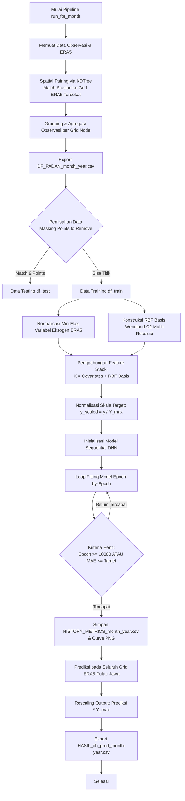

# Dokumentasi Arsitektur Model DeepKriging-Hybrid (1-Var OLR - Ver 5)

Dokumentasi ini menjelaskan secara menyeluruh arsitektur, basis matematis, alur pemrosesan data, serta struktur model jaringan saraf tiruan (DNN) yang diimplementasikan pada skrip [`kode2026_1var_recordloss5_newbasis.py`](file:///home/deepkriging/tsaqib/1_2026_DKNEW/1var_olr/kode2026_1var_recordloss5_newbasis.py).

---

## 1. Ringkasan Eksekutif & Konsep Dasar

Model ini menerapkan metode **DeepKriging-Hybrid**, yaitu penggabungan antara **Radial Basis Functions (RBF)** spasial multi-resolusi berbasis struktur kovarians **Wendland $C^2$** dengan **Deep Neural Network (DNN)** yang memanfaatkan variabel atmosferik eksogen dari reanalisis ERA5.

### Tujuan Utama
Melakukan interpolasi spasial dan prediksi curah hujan bulanan (*monthly rainfall* dalam mm) di seluruh wilayah Pulau Jawa berbasis data observasi permukaan dan covariate ERA5.

### Karakteristik Kunci Model
- **Input Kovariat Eksogen**: 1 variabel atmosferik ERA5 (`olr`) + koordinat geografis (`lat`, `lon`).
- **Fungsi Basis Spasial**: RBF Wendland $C^2$ berdukungan kompak (*compact support*) pada 3 tingkat resolusi ($4^2=16$, $8^2=64$, $16^2=256$).
- **Metode Pairing Spasial**: Pemasangan koordinat stasiun observasi ke grid terdekat ERA5 menggunakan **KDTree**.
- **Normalisasi Lanjutan**: Skala target dipetakan terhadap nilai maksimum $Y_{\text{max}}$, dan variabel eksogen dinormalisasi Min-Max berdasarkan subset *training*.

---

## 2. Alur Eksekusi & Flowchart (Mermaid Diagrams)

### 2.1 Alur Pemrosesan Data & Pipeline Eksekusi (End-to-End)



### 2.2 Arsitektur Detail Jaringan Saraf Tiruan (Deep Neural Network)

```mermaid
graph LR
    subgraph Input_Features [Input Layer Stack]
        X1[ERA5 Covariates Normalized<br/>1 Variabel Eksogen: olr]
        X2[RBF Basis Wendland C2<br/>Multi-resolution: 4x4, 8x8, 16x16]
    end

    subgraph DNN_Layers [Deep Neural Network Architecture]
        Input[Concatenated Features<br/>Dimension: Num_Cov + Num_Active_Basis] --> Dense1[Dense Layer 1<br/>64 Units, ReLU, L2 Regularizer 0.001<br/>Initializer: He Uniform]
        Dense1 --> BN[Batch Normalization]
        BN --> Drop1[Dropout 30%]
        Drop1 --> Dense2[Dense Layer 2<br/>32 Units, ReLU, L2 Regularizer 0.001]
        Dense2 --> Drop2[Dropout 20%]
        Drop2 --> Dense3[Dense Layer 3<br/>16 Units, ReLU]
        Dense3 --> Out[Output Layer<br/>1 Unit, Linear Activation]
    end

    Input_Features --> Input
    Out --> YPred[Scaled Prediction y_hat]
```



---

## 3. Rincian Komponen & Formula Matematika

### 3.1 Variabel Eksogen ERA5
Variabel yang diekstrak dari dataset bulanan ERA5 (`EKSOGEN_COLS`):
1. **`lat`**: Garis Lintang
2. **`lon`**: Garis Bujur
3. **`olr`**: Outgoing Longwave Radiation

**Skala Normalisasi (Min-Max)**:

Setiap fitur eksogen $X_{:, i}$ dinormalisasi berdasarkan nilai minimum ($\text{lo}$) dan maksimum ($\text{hi}$) pada data *training*:

$$X_{\text{norm}, i} = \frac{X_{:, i} - \text{lo}_i}{\text{hi}_i - \text{lo}_i}$$

---

### 3.2 Fungsi Basis Spasial RBF (Wendland $C^2$)

Untuk menangkap variasi spasial lokal dan non-stasioneritas, dibangun basis RBF berdukungan kompak (*compact support*) Wendland $C^2$ pada 3 tingkat gridding resolusi spasial:

$$\text{NUM}_{\text{basis}} = [4^2, 8^2, 16^2] = [16, 64, 256] \quad (\text{Total } 336 \text{ basis sebelum pangkas})$$

#### Parameter & Formula Wendland $C^2$:

**1. Normalisasi Koordinat Spasial**:

$$\text{norm}_{\text{lon}} = \frac{\text{lon} - \min(\text{lon}_{\text{obs}})}{\max(\text{lon}_{\text{obs}}) - \min(\text{lon}_{\text{obs}})}, \quad \text{norm}_{\text{lat}} = \frac{\text{lat} - \min(\text{lat}_{\text{obs}})}{\max(\text{lat}_{\text{obs}}) - \min(\text{lat}_{\text{obs}})}$$

**2. Parameter Jangkauan (Scale / Bandwidth $\theta$)**:

Untuk setiap resolusi $n \in \{16, 64, 256\}$:

$$\theta = \frac{1}{\sqrt{n} \times 2.5}$$

**3. Jarak Terbobot (Scalability Distance $d$)**:

$$d_i = \frac{\sqrt{(\text{norm}_{\text{lon}} - x_k)^2 + (\text{norm}_{\text{lat}} - y_k)^2}}{\theta}$$

**4. Fungsi Basis Wendland $C^2$**:

$$\phi_i(d) = \begin{cases} \frac{(1 - d)^6 (35 d^2 + 18 d + 3)}{3}, & \text{jika } 0 \le d \le 1 \\ 0, & \text{lainnya} \end{cases}$$

Fungsi basis yang bernilai $0$ di seluruh domain dieliminasi untuk efisiensi komputasi.

---

### 3.3 Pemisahan Data Training & Testing (Spatial Masking)

Pemisahan data tidak dilakukan secara acak, melainkan dengan menentukan 9 titik koordinat tertentu sebagai data uji spasial (*testing set*) untuk mengevaluasi akurasi generasi spasial model:
- `(106.5, -6.25)`
- `(107.0, -6.75)`
- `(112.25, -7.0)`
- `(110.0, -7.0)`
- `(107.5, -7.25)`
- `(110.0, -7.5)`
- `(111.75, -7.75)`
- `(113.5, -8.0)`
- `(112.25, -8.25)`

Titik yang cocok dipisahkan ke `df_test`, sedangkan sisa titik dijadikan `df_train`.

---

### 3.4 Detail Lapisan & Hyperparameter Neural Network

| Layer / Komponen | Tipe Layer / Fungsi | Konfigurasi / Hyperparameter | Tujuan & Keterangan |
| :--- | :--- | :--- | :--- |
| **Input Feature Stack** | Concatenation | $X = [X_{\text{cov}_{\text{norm}}}, \Phi_{\text{rbf}_{\text{train}}}]$ | Memadukan fitur atmosferik & basis spasial |
| **Layer 1** | `Dense` | 64 unit, Aktivasi `ReLU`, `he_uniform` | Feature extraction non-linear awal |
| **Regularisasi 1** | `l2(0.001)` | $L_2$ weight penalty | Mencegah overfitting |
| **Batch Normalization** | `BatchNormalization` | Default Keras settings | Menstabilkan distribusi gradien antar epoch |
| **Dropout 1** | `Dropout` | Rate = 0.3 (30%) | Mengurangi ketergantungan antar neuron |
| **Layer 2** | `Dense` | 32 unit, Aktivasi `ReLU` | Abstraksi tingkat menengah |
| **Regularisasi 2** | `l2(0.001)` | $L_2$ weight penalty | Pengendalian bobot jaringan |
| **Dropout 2** | `Dropout` | Rate = 0.2 (20%) | Regularisasi tambahan |
| **Layer 3** | `Dense` | 16 unit, Aktivasi `ReLU` | Kompresi fitur sebelum regresi akhir |
| **Output Layer** | `Dense` | 1 unit, Aktivasi `Linear` | Output prediksi rasio curah hujan $\hat{y}$ |
| **Optimizer** | `Adam` | Learning Rate = 0.0005 | Optimasi stokastik berbasis momen |
| **Loss Function** | `MSE` | Mean Squared Error | Minimasi kuadrat eror |
| **Metrik Tambahan** | `MAE` | Mean Absolute Error | Evaluasi rata-rata magnitudo eror |

---

### 3.5 Skaling Target & Penyesuaian Satuan Metrik

Target curah hujan dinormalisasi:

$$y_{\text{train}} = \frac{y_{\text{train0}}}{Y_{\text{max}}}, \quad Y_{\text{max}} = \max(y_{\text{train0}})$$

Pada saat pencatatan sejarah *history*, metrik dikembalikan ke satuan asli (mm):

$$\text{MAE}_{\text{asli}} = \text{MAE}_{\text{scaled}} \times Y_{\text{max}}$$

$$\text{Loss (MSE)}_{\text{asli}} = \text{Loss}_{\text{scaled}} \times Y_{\text{max}}^2$$

---

## 4. Parameter Konfigurasi Skrip

Beberapa parameter utama yang dapat dikonfigurasi melalui variabel lingkungan maupun konstanta skrip:

```python
YEAR = int(os.environ.get('PIPELINE_YEAR', 2014))   # Tahun eksekusi pipeline
MONTH_START = int(os.environ.get('PIPELINE_MONTH', 1)) # Bulan eksekusi
MAE_TARGET = 0.000002                              # Kriteria batas penghentian MAE
MAX_EPOCHS = 10000                                  # Maksimum iterasi epoch
NUM_BASIS = [4**2, 8**2, 16**2]                     # Resolusi basis RBF (16, 64, 256)
```

---

## 5. Output File & Struktur Direktori Hasil

Setiap eksekusi akan menyimpan berkas luaran di direktori `HASIL VER 5/{YEAR}/`:

1. **`DF_PADAN_{month}_{year}.csv`**  
   Data gabungan koordinat, variabel eksogen ERA5, dan nilai observasi stasiun yang telah dipadankan.
2. **`HISTORY_METRICS_{month}_{year}.csv`**  
   Catatan per-epoch nilai `mae_train`, `mae_test`, `loss_train`, dan `loss_test` dalam satuan mm / $\text{mm}^2$.
3. **`HASIL_ch_pred_{month}-{year}.csv`**  
   Hasil prediksi curah hujan di seluruh titik grid ERA5 Pulau Jawa (kolom: `longitude`, `latitude`, `ch_pred`).
4. **`METRICS_CURVE_{month}_{year}.png`**  
   Visualisasi grafik kurva pembelajaran (MAE dan MSE Loss) untuk data training dan testing.
