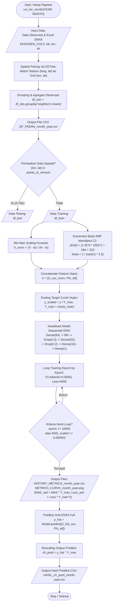
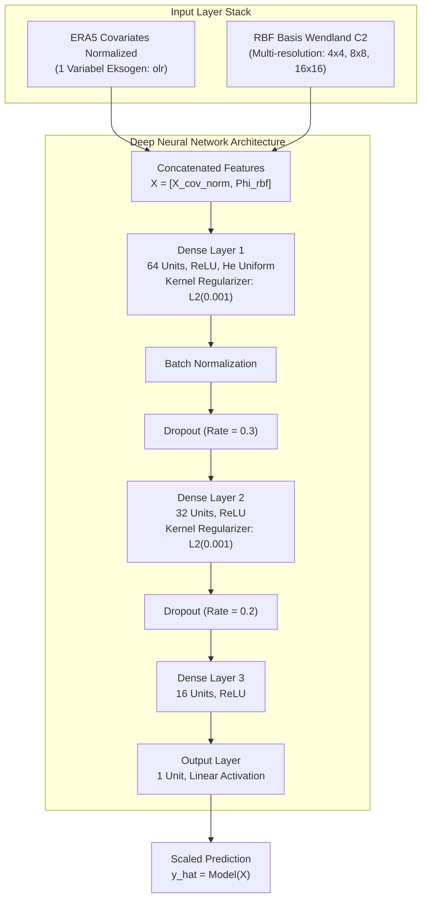

# Dokumentasi Arsitektur Model DeepKriging-Hybrid (1-Var OLR - Ver 5)

Dokumentasi ini menjelaskan secara menyeluruh arsitektur, basis matematis, alur pemrosesan data, serta struktur model jaringan saraf tiruan (DNN) yang diimplementasikan pada skrip [`kode2026_1var_recordloss5_newbasis.py`](file:///home/deepkriging/tsaqib/1_2026_DKNEW/1var_olr/kode2026_1var_recordloss5_newbasis.py).

---

## 1. Ringkasan Eksekutif & Konsep Dasar

Model ini menerapkan metode **DeepKriging-Hybrid**, yaitu penggabungan antara **Radial Basis Functions (RBF)** spasial multi-resolusi berbasis struktur kovarians **Wendland $C^2$** dengan **Deep Neural Network (DNN)** yang memanfaatkan variabel atmosferik eksogen dari reanalisis ERA5.

### Tujuan Utama
Melakukan interpolasi spasial dan prediksi curah hujan bulanan (*monthly rainfall* dalam mm) di seluruh wilayah Pulau Jawa berbasis data observasi permukaan dan covariate ERA5.

### Karakteristik Kunci Model
- **Input Kovariat Eksogen**: 1 variabel atmosferik ERA5 (`olr`) + koordinat geografis (`lat`, `lon`).
- **Fungsi Basis Spasial**: RBF Wendland $C^2$ berdukungan kompak (*compact support*) pada 3 tingkat resolusi ($4^2=16$, $8^2=64$, $16^2=256$).
- **Metode Pairing Spasial**: Pemasangan koordinat stasiun observasi ke grid terdekat ERA5 menggunakan **KDTree**.
- **Normalisasi Lanjutan**: Skala target dipetakan terhadap nilai maksimum $Y_{\text{max}}$, dan variabel eksogen dinormalisasi Min-Max berdasarkan subset *training*.

---

## 2. Alur Eksekusi & Flowchart (Mermaid Diagrams)

Legenda Bentuk Standar Flowchart:
- **Oval / Stadium `([])`**: Terminal Start / Stop (Mulai / Selesai).
- **Jajar Genjang `[/ /]`**: Input / Output Data dan Berkas.
- **Persegi Panjang `[ ]`**: Proses Komputasi / Pemrosesan Data.
- **Belah Ketupat `{" "}`**: Keputusan / Percabangan Logika (*Decision*).

### 2.1 Alur Pemrosesan Data & Pipeline Eksekusi (End-to-End)



---

### 2.2 Penjelasan Rinci Setiap Tahap / Box Flowchart

| Kode Node | Bentuk Simbol | Nama Tahap | Deskripsi Detail & Formula Operasi |
| :--- | :--- | :--- | :--- |
| **A** | Oval `([])` | **Start / Mulai** | Inisialisasi fungsi `run_for_month(YEAR, MONTH)` dengan parameter lingkungan (default: `YEAR=2014`, `MONTH=1`). Memulai sesi Keras. |
| **B** | Jajar Genjang `[/ /]` | **Input Data** | Memuat berkas observasi `sum_bulanan_rainfall_1.txt` dan file ERA5 `processed_era5jawa_{year}_{month}.xlsx`. Ekstraksi kolom `lat`, `lon`, `olr`. |
| **C** | Persegi Panjang `[ ]` | **KDTree Pairing** | Mencari tetangga terdekat grid ERA5 untuk setiap stasiun observasi menggunakan algoritma KDTree spasial 2D berdasarkan jarak Euclidean koordinat. |
| **D** | Persegi Panjang `[ ]` | **Agregasi Observasi** | Mengelompokkan stasiun yang terpasang pada grid node yang sama dengan operasi rerata: `df_rain = df_obs.groupby("neighbor")[["monthly_rainfall"]].mean()`. |
| **E** | Jajar Genjang `[/ /]` | **Export DF_PADAN** | Menyimpan dataset hasil pairing lengkap yang berisi nilai observasi dan variabel eksogen ERA5 ke berkas `DF_PADAN_{month}_{year}.csv`. |
| **F** | Belah Ketupat `{" "}` | **Pemisahan Masking** | Evaluasi kondisi percabangan spasial: apakah koordinat $(lon, lat)$ termasuk dalam daftar 9 titik *testing* (`points_to_remove`). |
| **G** | Jajar Genjang `[/ /]` | **Data Testing** | Subset titik yang cocok dengan 9 koordinat uji dipisahkan ke dataframe `df_test` untuk validasi independen. |
| **H** | Jajar Genjang `[/ /]` | **Data Training** | Sisa titik observasi dipisahkan ke dataframe `df_train` sebagai data latih model. |
| **I** | Persegi Panjang `[ ]` | **Min-Max Scaling Kovariat** | Fitur atmosferik OLR dinormalisasi ke rentang $[0, 1]$ berdasarkan nilai minimum ($\text{lo}$) dan maksimum ($\text{hi}$) data training: $X_{\text{norm}} = \frac{X - \text{lo}}{\text{hi} - \text{lo}}$. |
| **J** | Persegi Panjang `[ ]` | **Konstruksi RBF Basis** | Pembentukan matriks basis spasial RBF Wendland $C^2$ pada 3 resolusi ($16, 64, 256$). Membuang basis yang tidak aktif ($\phi = 0$ di seluruh domain). |
| **K** | Persegi Panjang `[ ]` | **Concatenate Features** | Penggabungan matriks kovariat eksogen ter-skala dengan matriks RBF basis menjadi matriks fitur gabungan: $X = [X_{\text{cov}_{\text{norm}}}, \Phi_{\text{rbf}}]$. |
| **L** | Persegi Panjang `[ ]` | **Scaling Target** | Target curah hujan dinormalisasi dengan membagi terhadap nilai maksimum target training: $y_{\text{scaled}} = \frac{y}{Y_{\text{max}}}$, di mana $Y_{\text{max}} = \max(y_{\text{train0}})$. |
| **M** | Persegi Panjang `[ ]` | **Inisialisasi Model DNN** | Membangun jaringan saraf Sequential 3 layer (64 -> 32 -> 16 -> 1) dengan aktivasi ReLU, Batch Normalization, Dropout (30%, 20%), $L_2$ regularizer (0.001), dan optimizer Adam (learning rate = 0.0005). |
| **N** | Persegi Panjang `[ ]` | **Training Iteratif** | Fitting model epoch demi epoch dengan batch size 16. Evaluasi loss MSE & MAE pada data training dan testing. |
| **O** | Belah Ketupat `{" "}` | **Kriteria Henti** | Pengecekan kondisi henti loop training: apakah `epochs >= 10000` ATAU `MAE_scaled <= 0.000002`. Jika belum, iterasi dilanjutkan. |
| **P** | Jajar Genjang `[/ /]` | **Export History & Grafik** | Mengembalikan metrik ke satuan asli ($\text{MAE}_{\text{asli}} = \text{MAE}_{\text{scaled}} \times Y_{\text{max}}$, $\text{Loss}_{\text{asli}} = \text{Loss}_{\text{scaled}} \times Y_{\text{max}}^2$), menyimpannya ke `HISTORY_METRICS.csv`, dan menggambar `METRICS_CURVE.png`. |
| **Q** | Persegi Panjang `[ ]` | **Prediksi Grid Full** | Mengumpankan seluruh koordinat grid ERA5 Pulau Jawa (beserta RBF basis full $\Phi_{\text{all}}$) ke model terlatik untuk memperoleh output rasio $\hat{y}$. |
| **R** | Persegi Panjang `[ ]` | **Rescaling Output** | Mengalikan kembali output rasio jaringan dengan faktor skala target $Y_{\text{max}}$ untuk mendapatkan prediksi nilai curah hujan asli (mm): $\text{ch\_pred} = \hat{y} \times Y_{\text{max}}$. |
| **S** | Jajar Genjang `[/ /]` | **Export Hasil Prediksi** | Menyimpan koordinat `longitude`, `latitude`, dan `ch_pred` ke berkas luaran akhir `HASIL_ch_pred_{month}-{year}.csv`. |
| **T** | Oval `([])` | **Stop / Selesai** | Pipeline pemrosesan bulan selesai dengan sukses. |

---

### 2.3 Arsitektur Detail Jaringan Saraf Tiruan (Deep Neural Network)



---

## 3. Rincian Komponen & Formula Matematika

### 3.1 Variabel Eksogen ERA5
Variabel yang diekstrak dari dataset bulanan ERA5 (`EKSOGEN_COLS`):
1. **`lat`**: Garis Lintang
2. **`lon`**: Garis Bujur
3. **`olr`**: Outgoing Longwave Radiation ($\text{W/m}^2$)

**Skala Normalisasi (Min-Max)**:

Setiap fitur eksogen $X_{:, i}$ dinormalisasi berdasarkan nilai minimum ($\text{lo}$) dan maksimum ($\text{hi}$) pada data *training*:

$$X_{\text{norm}, i} = \frac{X_{:, i} - \text{lo}_i}{\text{hi}_i - \text{lo}_i}$$

---

### 3.2 Fungsi Basis Spasial RBF (Wendland $C^2$)

Untuk menangkap variasi spasial lokal dan non-stasioneritas, dibangun basis RBF berdukungan kompak (*compact support*) Wendland $C^2$ pada 3 tingkat gridding resolusi spasial:

$$\text{NUM}_{\text{basis}} = [4^2, 8^2, 16^2] = [16, 64, 256] \quad (\text{Total } 336 \text{ basis sebelum pangkas})$$

#### Parameter & Formula Wendland $C^2$:

**1. Normalisasi Koordinat Spasial**:

$$\text{norm}_{\text{lon}} = \frac{\text{lon} - \min(\text{lon}_{\text{obs}})}{\max(\text{lon}_{\text{obs}}) - \min(\text{lon}_{\text{obs}})}, \quad \text{norm}_{\text{lat}} = \frac{\text{lat} - \min(\text{lat}_{\text{obs}})}{\max(\text{lat}_{\text{obs}}) - \min(\text{lat}_{\text{obs}})}$$

**2. Parameter Jangkauan (Scale / Bandwidth $\theta$)**:

Untuk setiap resolusi $n \in \{16, 64, 256\}$:

$$\theta = \frac{1}{\sqrt{n} \times 2.5}$$

**3. Jarak Terbobot (Scalability Distance $d$)**:

$$d_i = \frac{\sqrt{(\text{norm}_{\text{lon}} - x_k)^2 + (\text{norm}_{\text{lat}} - y_k)^2}}{\theta}$$

**4. Fungsi Basis Wendland $C^2$**:

$$\phi_i(d) = \begin{cases} \frac{(1 - d)^6 (35 d^2 + 18 d + 3)}{3}, & \text{jika } 0 \le d \le 1 \\ 0, & \text{lainnya} \end{cases}$$

Fungsi basis yang bernilai $0$ di seluruh domain dieliminasi untuk efisiensi komputasi.

---

### 3.3 Pemisahan Data Training & Testing (Spatial Masking)

Pemisahan data tidak dilakukan secara acak, melainkan dengan menentukan 9 titik koordinat tertentu sebagai data uji spasial (*testing set*) untuk mengevaluasi akurasi generasi spasial model:
- `(106.5, -6.25)`
- `(107.0, -6.75)`
- `(112.25, -7.0)`
- `(110.0, -7.0)`
- `(107.5, -7.25)`
- `(110.0, -7.5)`
- `(111.75, -7.75)`
- `(113.5, -8.0)`
- `(112.25, -8.25)`

Titik yang cocok dipisahkan ke `df_test`, sedangkan sisa titik dijadikan `df_train`.

---

### 3.4 Detail Lapisan & Hyperparameter Neural Network

| Layer / Komponen | Tipe Layer / Fungsi | Konfigurasi / Hyperparameter | Tujuan & Keterangan |
| :--- | :--- | :--- | :--- |
| **Input Feature Stack** | Concatenation | $X = [X_{\text{cov}_{\text{norm}}}, \Phi_{\text{rbf}_{\text{train}}}]$ | Memadukan fitur atmosferik & basis spasial |
| **Layer 1** | `Dense` | 64 unit, Aktivasi `ReLU`, `he_uniform` | Feature extraction non-linear awal |
| **Regularisasi 1** | `l2(0.001)` | $L_2$ weight penalty | Mencegah overfitting |
| **Batch Normalization** | `BatchNormalization` | Default Keras settings | Menstabilkan distribusi gradien antar epoch |
| **Dropout 1** | `Dropout` | Rate = 0.3 (30%) | Mengurangi ketergantungan antar neuron |
| **Layer 2** | `Dense` | 32 unit, Aktivasi `ReLU` | Abstraksi tingkat menengah |
| **Regularisasi 2** | `l2(0.001)` | $L_2$ weight penalty | Pengendalian bobot jaringan |
| **Dropout 2** | `Dropout` | Rate = 0.2 (20%) | Regularisasi tambahan |
| **Layer 3** | `Dense` | 16 unit, Aktivasi `ReLU` | Kompresi fitur sebelum regresi akhir |
| **Output Layer** | `Dense` | 1 unit, Aktivasi `Linear` | Output prediksi rasio curah hujan $\hat{y}$ |
| **Optimizer** | `Adam` | Learning Rate = 0.0005 | Optimasi stokastik berbasis momen |
| **Loss Function** | `MSE` | Mean Squared Error | Minimasi kuadrat eror |
| **Metrik Tambahan** | `MAE` | Mean Absolute Error | Evaluasi rata-rata magnitudo eror |

---

### 3.5 Skaling Target & Penyesuaian Satuan Metrik

Target curah hujan dinormalisasi:

$$y_{\text{train}} = \frac{y_{\text{train0}}}{Y_{\text{max}}}, \quad Y_{\text{max}} = \max(y_{\text{train0}})$$

Pada saat pencatatan sejarah *history*, metrik dikembalikan ke satuan asli (mm):

$$\text{MAE}_{\text{asli}} = \text{MAE}_{\text{scaled}} \times Y_{\text{max}}$$

$$\text{Loss (MSE)}_{\text{asli}} = \text{Loss}_{\text{scaled}} \times Y_{\text{max}}^2$$

---

## 4. Parameter Konfigurasi Skrip

Beberapa parameter utama yang dapat dikonfigurasi melalui variabel lingkungan maupun konstanta skrip:

```python
YEAR = int(os.environ.get('PIPELINE_YEAR', 2014))   # Tahun eksekusi pipeline
MONTH_START = int(os.environ.get('PIPELINE_MONTH', 1)) # Bulan eksekusi
MAE_TARGET = 0.000002                              # Kriteria batas penghentian MAE
MAX_EPOCHS = 10000                                  # Maksimum iterasi epoch
NUM_BASIS = [4**2, 8**2, 16**2]                     # Resolusi basis RBF (16, 64, 256)
```

---

## 5. Output File & Struktur Direktori Hasil

Setiap eksekusi akan menyimpan berkas luaran di direktori `HASIL VER 5/{YEAR}/`:

1. **`DF_PADAN_{month}_{year}.csv`**  
   Data gabungan koordinat, variabel eksogen ERA5, dan nilai observasi stasiun yang telah dipadankan.
2. **`HISTORY_METRICS_{month}_{year}.csv`**  
   Catatan per-epoch nilai `mae_train`, `mae_test`, `loss_train`, dan `loss_test` dalam satuan mm / $\text{mm}^2$.
3. **`HASIL_ch_pred_{month}-{year}.csv`**  
   Hasil prediksi curah hujan di seluruh titik grid ERA5 Pulau Jawa (kolom: `longitude`, `latitude`, `ch_pred`).
4. **`METRICS_CURVE_{month}_{year}.png`**  
   Visualisasi grafik kurva pembelajaran (MAE dan MSE Loss) untuk data training dan testing.

---

## 6. Contoh Studi Kasus & Simulasi Perhitungan (Step-by-Step)

Untuk mempermudah pemahaman alur kerja dan perhitungan matematika dalam skrip, berikut simulasi contoh perhitungan angka konkret untuk eksekusi **Bulan Januari 2014**.

### Skenario Data Contoh:
- **Data Observasi Stasiun A**: Koordinat $\text{Lon} = 106.50^\circ$, $\text{Lat} = -6.25^\circ$, Curah Hujan Bulanan $y_0 = 350.0 \text{ mm}$.
- **Grid ERA5 Terdekat**: Grid #102 dengan nilai OLR $X_{\text{olr}} = 215.4 \text{ W/m}^2$.
- **Rentang OLR Data Training**: Minimum $\text{lo} = 180.0 \text{ W/m}^2$, Maksimum $\text{hi} = 280.0 \text{ W/m}^2$.
- **Maksimum Curah Hujan Training**: $Y_{\text{max}} = 500.0 \text{ mm}$.

---

### Langkah 1: KDTree Pairing & Masking Spasial
1. Stasiun A dipasangkan ke Grid ERA5 #102 via KDTree Euclidean Distance.
2. Pengecekan koordinat: $(106.50, -6.25)$ cocok dengan daftar `points_to_remove`.
3. **Hasil**: Stasiun A dialokasikan ke dataframe **`df_test`** (Data Testing).

---

### Langkah 2: Scaling Target & Normalisasi Min-Max Kovariat
1. **Scaling Target Curah Hujan**:
   $$y_{\text{scaled}} = \frac{y_0}{Y_{\text{max}}} = \frac{350.0 \text{ mm}}{500.0 \text{ mm}} = 0.7000$$

2. **Normalisasi Min-Max Fitur OLR**:
   $$X_{\text{norm}} = \frac{X_{\text{olr}} - \text{lo}}{\text{hi} - \text{lo}} = \frac{215.4 - 180.0}{280.0 - 180.0} = \frac{35.4}{100.0} = 0.3540$$

---

### Langkah 3: Perhitungan Basis Spasial RBF Wendland $C^2$
Misalkan untuk Knot Basis pada resolusi $4 \times 4$ ($n = 16$), diperoleh:
1. **Bandwidth $\theta$**:
   $$\theta = \frac{1}{\sqrt{16} \times 2.5} = \frac{1}{4 \times 2.5} = 0.10$$

2. **Jarak Terbobot $d$**:
   Jika jarak koordinat ter-skala ke pusat knot adalah $0.04$, maka:
   $$d = \frac{0.04}{\theta} = \frac{0.04}{0.10} = 0.40 \quad (0 \le d \le 1)$$

3. **Nilai Fungsi Basis $\phi(d)$**:
   $$\phi(0.40) = \frac{(1 - 0.40)^6 \times \left(35(0.40)^2 + 18(0.40) + 3\right)}{3}$$
   $$\phi(0.40) = \frac{(0.60)^6 \times (5.60 + 7.20 + 3.00)}{3} = \frac{0.046656 \times 15.80}{3} = \frac{0.73716}{3} \approx 0.2457$$

---

### Langkah 4: Prediksi DNN & Rescaling Output Asli (mm)
1. Matriks Fitur $X_{\text{final}} = [0.3540, 0.2457, \dots]$ dimasukkan ke model DNN.
2. Model mengembalikan hasil prediksi ter-skala:
   $$\hat{y}_{\text{scaled}} = 0.6800$$
3. **Rescaling ke Satuan Curah Hujan Asli (mm)**:
   $$\text{ch\_pred} = \hat{y}_{\text{scaled}} \times Y_{\text{max}} = 0.6800 \times 500.0 \text{ mm} = 340.0 \text{ mm}$$

---

### Langkah 5: Penyesuaian Metrik Evaluasi (MAE & MSE Loss)
Jika pada epoch tertentu Keras menghitung metrik scaled:
- $\text{MAE}_{\text{scaled}} = 0.0200$
- $\text{Loss (MSE)}_{\text{scaled}} = 0.0006$

Maka konversi ke satuan fisik asli adalah:
- **MAE Asli**:
  $$\text{MAE}_{\text{asli}} = 0.0200 \times 500.0 \text{ mm} = 10.0 \text{ mm}$$
- **Loss MSE Asli**:
  $$\text{Loss}_{\text{asli}} = 0.0006 \times (500.0 \text{ mm})^2 = 0.0006 \times 250000 = 150.0 \text{ mm}^2$$
